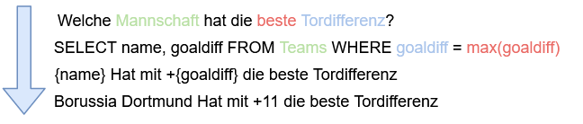

# der-12te-mann
A German-Language chatbot informing you about the ins and outs of the German Football Bundesliga

"der-12te-mann" means the 12th man in German. As a football team has 11 players, this is meant to refer to fans or even the "god of football" in the sports' context.

## Aim
The goal of this project (no pun intended) is to develop a informal chatbot, which will inform you about the 1st German Football Bundesliga activity and scores.
This should include:
- [x] Standings of Teams 
- [x] Scores of past Games 
- [x] Upcoming Games

Additionally the Bot should handle basic conversational elements like greetings, goodbyes etc.

## Technology

The Chatbot will be based on the [RASA](https://rasa.com/docs/) Framework.
For the retrieval of football-related info, I intend to use [Openliga](https://www.openligadb.de/).

### Project Structure
The extension of the chatbots functions mainly depends on two components:

Language training data and possible bot action/responses see files under `./data`

API calls, logic and formatting of statistics is handled through `./actions`

## Evaluation and Possible Extensions
The aim of the project was to develop a simple chatbot handling basic conversational functions, as well as informing 
about ongoings in football. This aim was achieved, reflecting a Minimum Viable Product (MVP). To make the bot more 
flexible and scalable in terms of functionality, the approach would need to be modified:

The football-statistics would need to be stored in a structured format like SQL or a 
[Graph-Based Database](https://towardsdatascience.com/what-is-a-graph-database-249cd7fdf24d).
The clients queries can then be transformed into formal database queries and inserted into templated responses.

For smaller additions it would be sufficient to add further custom actions. For example:
- Return the specific of the next game of a given team
- Provide the names of the scorers in a given game
- Recount the game history of two teams and make a prediction for the next encounter based on that data 

### Issues and Testing
Bugs of this project are tracked in the [issues](https://github.com/Herr-Whit/der-12te-mann/issues) tab. The adequacy 
and correctness of responses has not been systematically tested.

## Acknowledgements
I would like to acknowledge Oliver Guhr and his [German RASA template](https://github.com/oliverguhr/german-rasa-bot), 
which helped me to get going with a basis of German Training Data, as well as [Openliga](https://www.openligadb.de/) for 
providing the Statistics via API. 